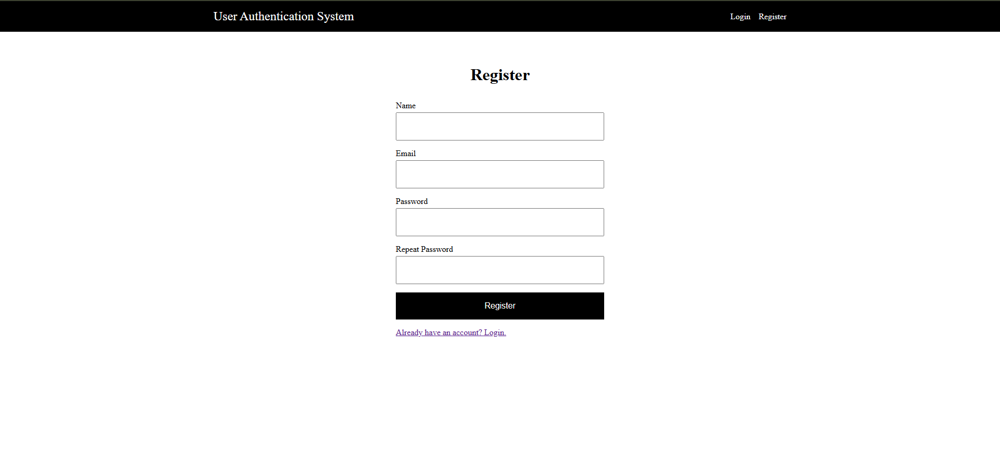
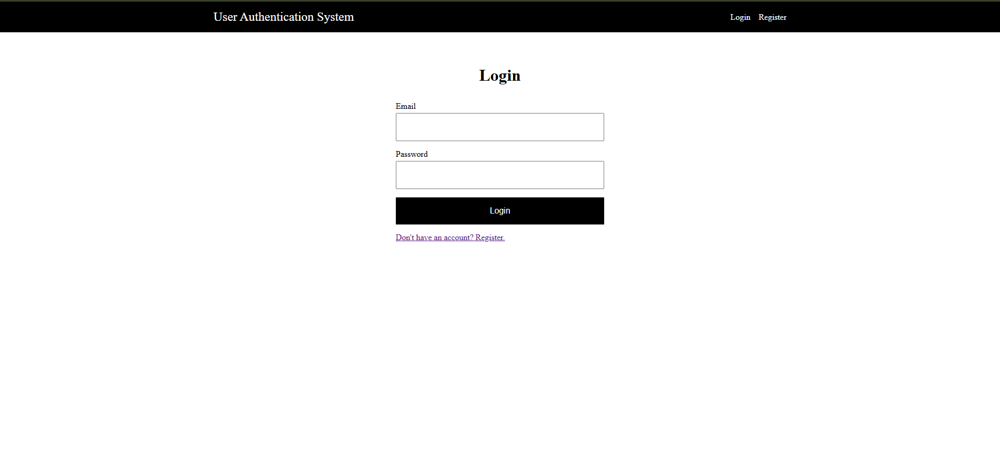
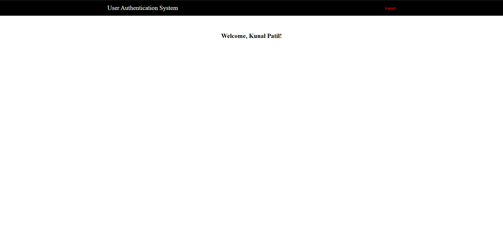

# User Authentication System

A complete User Authentication Web Application built with **Node.js, Express.js and MongoDB.** This project implements secure authentication using **JSON Web Token (JWT)** with server-side rendered views using **EJS** templates.

## Screenshots

### Registration page



### login page



### index page (Protected)



## Features

- User Registration
- User Login
- Logout functionality
- Password hashing using **bcrypt**
- JWT-based authentication
- Protected pages using authentication middleware
- Flash messages for errors & success feedback
- Server-side rendering using **EJS**
- Environment-based configuration

## Tech Stack

- **Backend**: Node.js, Express.js
- **Template Engine**: EJS
- **Authentication**: JSON Web Tokens (JWT)
- **Password Hashing**: bcrypt
- **Database**: MongoDB
- **Sessions / Cookies**: HTTP-only cookies
- **Styling**: CSS

## Live Demo

**URL**: https://user-authentication-system-ud4m.onrender.com/

## Setup for local installation

### Clone to repository

```bash
git clone https://github.com/kunalpatil22/user-authentication-system
cd user-authentication-system
```

### Install dependencies

```bash
npm install
```

### Configure environment variables

Create a `.env` file in root directory:

```env
PORT=8080
MONGO_URI='mongodb://127.0.0.1:27017/user_authentication_system'
JWT_SECRET='abc123xyz'
```

### Start Server

```bash
npm start
```

or (for development)

```bash
npm run dev
```

### Visit App at

```bash
http://127.0.0.1:8080
```

## Authentication Flow

1. User registers via a server-rendered form
2. Password is hashed before storing in the database
3. On successful login:
   - JWT is generated
   - Token is stored in an HTTP-only cookie
4. Middleware verifies JWT on every protected request
5. Authenticated users can access protected pages
6. Logout clears the authentication cookie

## Pages and Routes

| Page     | Route       | Access    |
| -------- | ----------- | --------- |
| Register | `/register` | Public    |
| Login    | `/login`    | Public    |
| Logout   | `/logout`   | Public    |
| Home     | `/`         | Protected |

## License

This project is licensed under the [MIT License](LICENSE).
